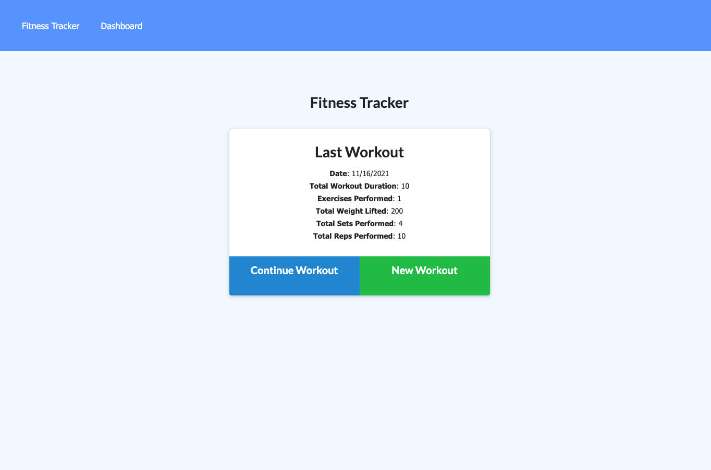
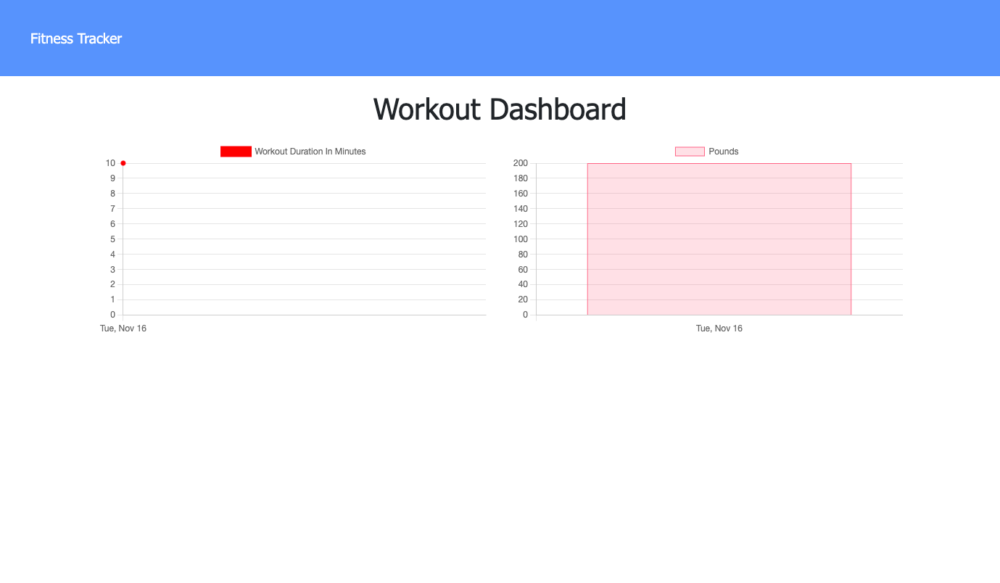
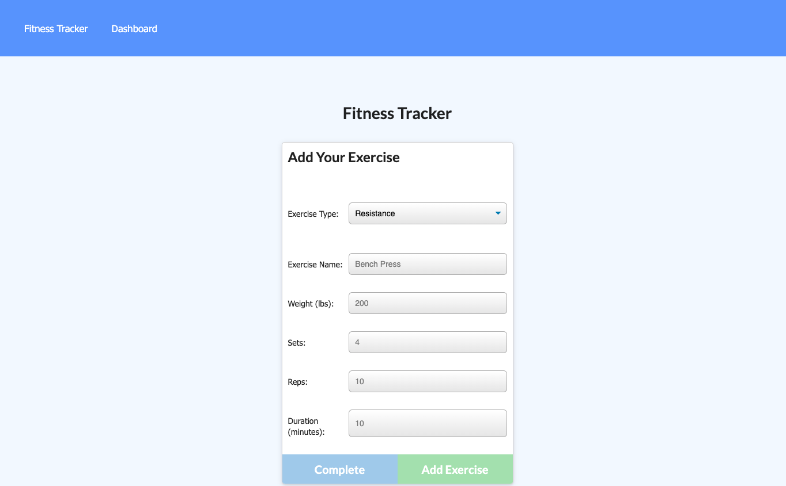

# workout-tracker

## Description
This app is a workout tracker. It allows users to create and view their daily workouts. This app also has a stats page to show the total duration of each workout, and the combined weight of multiple exercises from the past seven workouts.

The front-end is built by HTML and CSS. The routes are built by Express, and I use Mongo databse to store the data.

Run this command to start the application's server
~~~
npm start
~~~

## Link to the deployed app
[workout tracker](https://workout-tracker-zl-2021.herokuapp.com/)

## Screenshot of the app

## Installation
Run this command to install the packages:
~~~
npm i
~~~

Run this command to seed the database from the command line:
~~~
npm run seed
~~~

## Questions
if you have any questions about the repo, open an issue or contact me directly at [decyctus@gmail.com](decyctus@gmail.com). You can find more of my work at[ZackLai21](https://github.com/ZackLai21).
